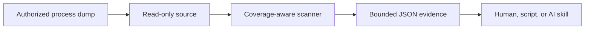

<div align="center">

# Membridge

**A deterministic, bounded bridge between AI workflows and process memory.**

[](https://github.com/sharkone/membridge/actions/workflows/ci.yml)
[](https://www.rust-lang.org/)
[](LICENSE-MIT)

</div>

Membridge gives humans, scripts, and AI coding agents a compact read-only interface to authorized process-memory captures. The tool performs exact mechanics—coverage inspection, byte scanning, address attribution, and bounded reads—while the caller decides what values mean and how findings relate to source code.

The project is an early public prototype. Its first source is Windows x64 user-mode minidumps; live process and DMA acquisition remain roadmap work.

## Why Membridge?

Sending arbitrary memory to a language model is unsafe, expensive, and usually useless. Membridge keeps bulk memory local and returns only bounded evidence:

- explicit capture coverage and gaps;
- tagged exact-byte matches;
- virtual addresses, modules, RVAs, and region metadata;
- deterministic match limits and continuation points;
- small caller-requested byte windows.



## Current capabilities

- Windows x64 `Memory64ListStream` and `MemoryListStream` minidumps.
- Windows-only live-process capture into a full-memory minidump, published atomically and imported automatically.
- Memory-mapped, zero-copy scanning of captured bytes.
- BLAKE3 source fingerprints.
- Region state, protection, type, and capture coverage.
- Module names, image bases, sizes, timestamps, and match RVAs.
- Tagged batches of 1–64 exact byte patterns.
- Overlapping and page-boundary matches.
- Per-pattern alignment constraints.
- Deterministic result ordering and hard match quotas.
- Gap-aware reads capped at 65,536 bytes.
- One compact schema-v2 JSON object per command.
- A version-matched portable Agent Skill embedded in the binary.

## Deliberate boundaries

Membridge does not currently:

- attach to or live-scan running processes (only a one-shot Windows capture is supported);
- write, allocate, protect, suspend, or execute memory;
- resolve PDB symbols;
- disassemble or infer structures;
- scan typed values, masked patterns, pointers, or YARA rules;
- classify sensitive data automatically;
- send telemetry or contact network services.

See [ROADMAP.md](ROADMAP.md) for the planned sequence and [PLAN.md](PLAN.md) for current implementation decisions.

## Quick start

### Requirements

- An authorized Windows x64 user-mode minidump for real analysis.

### Install `v0.1.0-alpha.1`

macOS and Linux:

```sh
curl --proto '=https' --tlsv1.2 -LsSf \
  https://github.com/sharkone/membridge/releases/download/v0.1.0-alpha.1/membridge-installer.sh |
  sh

membridge skill install --target "$HOME/.agents/skills" --force
```

Windows PowerShell:

```powershell
irm https://github.com/sharkone/membridge/releases/download/v0.1.0-alpha.1/membridge-installer.ps1 | iex
membridge skill install --target "$HOME\.agents\skills" --force
```

The release installers place `membridge` under Cargo's binary directory. The published alpha requires the explicit `--target` shown above; current development builds use the same common location by default. Agent discovery support for that location varies. Alpha binaries are checksummed but unsigned and not notarized.

### Install the latest development build

Install the current `main` revision directly from GitHub:

```sh
cargo install \
  --git https://github.com/sharkone/membridge.git \
  --locked \
  --force

membridge skill install --force
```

Development installation requires Rust on `PATH`.

### Build

```sh
cargo build --release
```

The executable is `target/release/membridge` on Unix-like hosts and `target\release\membridge.exe` on Windows.

### Run the deterministic demo

The repository includes a synthetic Windows AMD64 minidump generator. Its fixture contains two readable canaries, one canary crossing a page boundary, an identical no-access decoy, and one missing readable region.

```sh
./examples/demo.sh
```

The expected scan matches are:

```text
0x0000000140000100
0x0000000140000ffc
```

The no-access decoy is excluded, and coverage reports 4,096 unavailable readable bytes.

## Command surface

```text
membridge inspect <dump>
membridge scan <dump> --spec <path|->
membridge read <dump> --address <address> [--length <1..65536>]
membridge skill install [--force]
membridge capture minidump --pid <pid> --output <path> [--force]
```

Command execution emits one compact JSON object. Standard metadata flags such as `--help` and `--version` print text and exit successfully. Success responses have:

```json
{
  "schema": 2,
  "ok": true,
  "command": "inspect",
  "data": {}
}
```

Failures contain a stable code, human message, and retryability flag.

## Inspect coverage first

```sh
membridge inspect capture.dmp
```

Important fields:

- `data.source.fingerprint`
- `data.coverage.metadata_complete`
- `data.coverage.coverage_complete`
- `data.coverage.unavailable_readable_bytes`
- `data.coverage.limitations`
- `data.regions`
- `data.modules`

A dump may parse successfully while omitting readable process memory. Membridge exposes that distinction rather than turning missing pages into false negatives.

`limitations` is a deterministically ordered list with at most four stable codes:

- `MEMORY_METADATA_MISSING`: the dump has no memory-information stream;
- `MEMORY_METADATA_UNUSABLE`: the stream exists but cannot be parsed;
- `EXPECTED_READABLE_SCOPE_UNPROVEN`: available metadata cannot establish the process's expected readable scope;
- `KNOWN_READABLE_BYTES_MISSING`: metadata identifies readable bytes absent from the capture; `unavailable_readable_bytes` gives the exact known count.

Missing or unusable metadata is accompanied by `EXPECTED_READABLE_SCOPE_UNPROVEN`. In that case, zero unavailable bytes does not prove complete coverage.

## Scan exact representations

Create a versioned specification:

```json
{
  "schema": 1,
  "patterns": [
    {
      "tag": "canary.utf8",
      "bytes_hex": "4d42524944474521",
      "alignment": 1
    }
  ],
  "max_matches": 10000
}
```

Then scan:

```sh
membridge scan capture.dmp --spec scan.json
```

For sensitive values, prefer a protected file or stdin instead of command-line arguments:

```sh
membridge scan capture.dmp --spec - < scan.json
```

Interpret the result using both dimensions:

- `scan_complete` says whether scanning exhausted the selected captured scope;
- `coverage_complete` says whether the capture contained all expected readable memory.

A complete scan over incomplete coverage proves only “not observed in captured scope.”

Use `coverage.limitations` to explain incomplete coverage. Do not infer the cause from the booleans or byte counts alone.

## Read bounded context

```sh
membridge read capture.dmp \
  --address 0x0000000140000100 \
  --length 64
```

Reads return one or more valid segments. `complete: false` means some requested bytes were absent. Never concatenate separated segments as if they were contiguous memory.

## Capture a live process (Windows only)

```sh
membridge capture minidump --pid 4104 --output capture.dmp
```

`capture minidump` opens only the requested process with read-only rights, calls `MiniDumpWriteDump` with a full-memory profile, publishes the result atomically, and immediately imports it. Every other host returns `UNSUPPORTED_HOST`. An existing `--output` path is left untouched unless `--force` is passed.

The response reports:

- `data.process`: PID, resolved image path, and process creation time;
- `data.interval`: capture start and completion timestamps;
- `data.flags`: the exact `MiniDumpWriteDump` profile used;
- `data.warnings`: bounded, stable capture-time conditions such as `PROCESS_ALREADY_EXITED`;
- `data.source` and `data.coverage`: identical in shape to `inspect`, computed by re-opening the published file, so the report never has to be trusted blindly.

Feed the resulting file straight into `inspect`, `scan`, or `read`; capture never scans or reads memory itself.

## Agent Skill

The canonical portable skill lives at [.agents/skills/membridge](.agents/skills/membridge). Agent Skills clients can discover it directly from this repository, and the binary embeds the same files at compile time.

The Agent Skills specification standardizes the skill directory and `SKILL.md`, not a universal marketplace catalog or user installation path. `.agents/skills` is the cross-client convention; marketplace adapters remain optional client integrations.

### Portable direct install

Current development builds install the embedded version-matched skill into the common user location:

```sh
membridge skill install
```

The destination is `~/.agents/skills/membridge`. Membridge reads `HOME` on macOS and Linux and `USERPROFILE`, with `HOME` as a fallback, on Windows. The resolved home directory must be absolute; unavailable or invalid home discovery reports `HOME_DIRECTORY_UNAVAILABLE`.

Installation output includes matching `binary_version` and `skill_version` fields. Installed copies do not update automatically; rerun the command with `--force` after updating the binary.

The installed skill also includes explicit, version-pinned binary bootstrap scripts under `scripts/`. If the matching executable is absent, an agent may offer to run the host script after explaining the download and receiving user approval:

```sh
sh scripts/install.sh
```

```powershell
powershell -NoProfile -ExecutionPolicy Bypass -File .\scripts\install.ps1
```

The scripts enforce download size limits and SHA-256 verification before installing executable code, then verify `membridge --version`. They skip installation when the matching binary is already available. They never run during skill discovery or activation and perform no update check after installation.

Clients that do not scan the common user location can install the repository skill through their own Agent Skills installer or native skill directory. The tool and canonical skill do not depend on OMP, Claude Code, or another specific coding agent.

### Optional OMP and Claude Code marketplace adapter

There is no generic marketplace directory in the Agent Skills standard. `.agents/plugins/marketplace.json` is currently a Codex plugin catalog with a different schema, not a portable replacement. The canonical `.agents/skills` tree already covers Agent Skills-compatible clients, including Codex skill discovery. This repository therefore keeps marketplace packaging optional and uses the Claude Code-compatible `.claude-plugin/marketplace.json` adapter because OMP deliberately loads that same format as a compatibility fallback.

OMP:

```sh
omp plugin marketplace add sharkone/membridge
omp plugin install membridge@membridge
```

Claude Code:

```text
/plugin marketplace add sharkone/membridge
/plugin install membridge@membridge
```

The catalog points directly at the canonical `.agents` tree, whose `skills/membridge` directory is already a valid plugin layout. No second skill copy is maintained.

Marketplace package versions use `<binary-version>.skill.<revision>`. This lets skill-only releases upgrade independently while preserving the exact compatible Membridge binary version; the skill still checks that binary before use.

The marketplace adapter installs and updates the skill package, including its opt-in bootstrap scripts, but does not execute them. Plugin installation has no portable arbitrary lifecycle-hook contract; native installation therefore remains a separate, explicit, user-approved action.

The skill describes the available commands, analyses, limits, result semantics, and deliberate boundaries. It contains no unimplemented roadmap commands.

## Use cases

### Sensitive-data canaries

Place known non-production canaries in authorized dev builds, capture the process, and search their explicit UTF-8, UTF-16LE, numeric, or serialized byte forms. Use the region and module attribution to identify unexpected copies.

### Copy and lifetime investigation

Compare where a known value appears across controlled captures. Current Membridge analyzes each dump independently; persisted cross-snapshot refinement is planned.

### Protection validation

Confirm whether plaintext or decoded material remains in readable committed memory after the application claims to erase or protect it. An incomplete capture cannot prove absence.

### Reverse-engineering support

Locate known headers, identifiers, and sentinel values, then hand exact addresses and RVAs to a debugger or disassembler. Membridge does not replace those tools.

Only use Membridge on processes and captures you are authorized to inspect.

## Architecture

```text
src/source/       acquisition-neutral read-only interfaces and minidump adapter
src/capture.rs    Windows-only MiniDumpWriteDump live-process capture
src/scan.rs       deterministic tagged exact-byte scanner
src/protocol.rs   schema-v2 success and failure envelopes
src/skill.rs      version-matched embedded skill installer
src/main.rs       compact CLI surface
.agents/skills/   canonical portable AI workflow knowledge
.claude-plugin/    Claude Code-compatible marketplace catalog loaded by OMP
tests/            behavioral source, scanner, quota, read, CLI, and skill tests
examples/         deterministic fixture and runnable demo
```

The internal source boundary has no write operation. Future Windows and VMM sources must reuse the same normalized process-memory contract rather than create parallel scan engines.

## Development

```sh
cargo fmt --all --check
cargo clippy --all-targets -- -D warnings
cargo test
./examples/demo.sh
```

Repository expectations and invariants are defined in [AGENTS.md](AGENTS.md). Planned work is tracked in [ROADMAP.md](ROADMAP.md) and GitHub issues. Pull requests should update documentation and the embedded skill whenever observable CLI behavior changes.

## Status and licensing

Membridge is licensed under either the [MIT License](LICENSE-MIT) or [Apache License 2.0](LICENSE-APACHE), at your option. `v0.1.0-alpha.1` is an unsigned testing release. VMM/MemProcFS distribution remains gated on a separate licensing and packaging decision.
