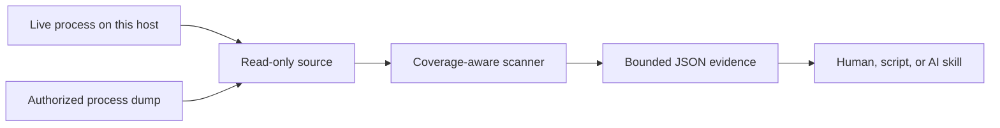

<div align="center">

# Membridge

**A deterministic, bounded bridge between AI workflows and process memory.**

[](https://github.com/sharkone/membridge/actions/workflows/ci.yml)
[](https://www.rust-lang.org/)
[](LICENSE-MIT)

</div>

Membridge gives humans, scripts, and AI coding agents a compact read-only interface to authorized process memory — either a running process on this host or a captured minidump. The tool performs exact mechanics—coverage inspection, byte scanning, address attribution, and bounded reads—while the caller decides what values mean and how findings relate to source code.

The project is an early public prototype. It reads live processes on macOS, Linux, and Windows, and Windows x64 user-mode minidumps everywhere; DMA and system-wide acquisition remain roadmap work.

## Why Membridge?

Sending arbitrary memory to a language model is unsafe, expensive, and usually useless. Membridge keeps bulk memory local and returns only bounded evidence:

- explicit capture coverage and gaps;
- tagged matches for typed, string, and masked values;
- bounded, explicit scan scopes;
- virtual addresses, modules, RVAs, and region metadata;
- deterministic match limits and continuation points;
- small caller-requested byte windows.



## Current capabilities

- Live read-only inspection of a running process on macOS, Linux, and Windows, selected with `--pid`.
- Windows x64 `Memory64ListStream` and `MemoryListStream` minidumps on every host.
- Windows-only live-process capture into a full-memory minidump, published atomically and imported automatically.
- Memory-mapped, zero-copy scanning of captured bytes; chunked, scope-bounded reads for live sources.
- BLAKE3 source fingerprints; live sources fingerprint process identity, not content.
- Region state, portable access rights, native protection, type, and capture coverage.
- Module names, image bases, sizes, identities (PE `TimeDateStamp`, Mach-O `LC_UUID`), and match RVAs.
- Tagged batches of 1–64 patterns: exact bytes, integers, floats, UTF-8, UTF-16LE, and masks.
- Explicit integer width, signedness, and byte order; exact `f32`/`f64` bit patterns.
- Byte- and nibble-granular masked patterns.
- Bounded scan scopes over modules, regions, address ranges, access rights, and memory types.
- Overlapping, page-boundary, and chunk-boundary matches.
- Per-pattern alignment constraints.
- Deterministic result ordering and hard match quotas.
- Gap-aware reads capped at 65,536 bytes.
- One compact schema-v4 JSON object per command.
- A version-matched portable Agent Skill embedded in the binary.

## Deliberate boundaries

Membridge does not currently:

- write, allocate, protect, suspend, or execute memory in a target;
- attach as a debugger, stop a target, or set breakpoints;
- freeze a live target, so a live scan observes a moving process rather than an instant;
- resolve PDB or DWARF symbols;
- disassemble, decode values it finds, or infer structures;
- scan pointers or YARA rules, or refine results across observations;
- classify sensitive data automatically;
- send telemetry or contact network services.

See [ROADMAP.md](ROADMAP.md) for the planned sequence and [PLAN.md](PLAN.md) for current implementation decisions.

## Quick start

### Requirements

- For live inspection, a process this host authorizes you to read. See [Live process access](#live-process-access).
- For dump analysis, an authorized Windows x64 user-mode minidump.

### Install via the plugin marketplace (recommended)

Membridge ships as a portable [Agent Skill](.agents/skills/membridge) with a marketplace catalog that OMP and Claude Code load directly from this repository — no separate registry, no copied skill tree.

OMP:

```sh
omp plugin marketplace add sharkone/membridge
omp plugin install membridge@membridge
```

Claude Code:

```text
/plugin marketplace add sharkone/membridge
/plugin install membridge@membridge
```

This installs the version-matched skill. If your agent doesn't already have a matching `membridge` executable on `PATH`, the skill's own instructions let it offer to run a checksum-verified bootstrap script after your explicit approval. See [Agent Skill](#agent-skill) for the installed layout, versioning, and exactly what that bootstrap does and does not do.

Other Agent Skills clients can point their own skill loader directly at [.agents/skills/membridge](.agents/skills/membridge).

### Install the CLI directly

macOS and Linux:

```sh
curl --proto '=https' --tlsv1.2 -LsSf \
  https://github.com/sharkone/membridge/releases/download/v0.1.0-alpha.4/membridge-installer.sh |
  sh

membridge skill install --force
```

Windows PowerShell:

```powershell
irm https://github.com/sharkone/membridge/releases/download/v0.1.0-alpha.4/membridge-installer.ps1 | iex
membridge skill install --force
```

The release installers place `membridge` under Cargo's binary directory. `membridge skill install` installs directly to the common `~/.agents/skills` location; agent discovery support for that location varies. Alpha binaries are checksummed but unsigned and not notarized.

## Command surface

```text
membridge inspect <dump> | --pid <pid>
membridge scan <dump> | --pid <pid> --spec <path|->
membridge read <dump> | --pid <pid> --address <address> [--length <1..65536>]
membridge skill install [--force]
membridge capture minidump --pid <pid> --output <path> [--force]
```

`inspect`, `scan`, and `read` take exactly one source: a minidump path or `--pid`. Supplying both, or neither, fails with `INVALID_ARGUMENT`.

Command execution emits one compact JSON object. Standard metadata flags such as `--help` and `--version` print text and exit successfully. Success responses have:

```json
{
  "schema": 4,
  "ok": true,
  "command": "inspect",
  "data": {}
}
```

Failures contain a stable code, human message, and retryability flag.

## Inspect coverage first

```sh
membridge inspect capture.dmp
membridge inspect --pid 4242
```

Important fields:

- `data.source.fingerprint`
- `data.source.immutable`
- `data.coverage.metadata_complete`
- `data.coverage.coverage_complete`
- `data.coverage.unavailable_readable_bytes`
- `data.coverage.observation`
- `data.coverage.limitations`
- `data.regions`
- `data.modules`

A dump may parse successfully while omitting readable process memory, and a live process may refuse a page it advertised as readable. Membridge exposes both distinctions rather than turning missing pages into false negatives.

`limitations` is a deterministically ordered list with at most six stable codes:

- `MEMORY_METADATA_MISSING`: the dump has no memory-information stream;
- `MEMORY_METADATA_UNUSABLE`: the stream exists but cannot be parsed;
- `EXPECTED_READABLE_SCOPE_UNPROVEN`: the source's expected readable scope was not established or not fully read;
- `KNOWN_READABLE_BYTES_MISSING`: metadata identifies readable bytes absent from the capture; `unavailable_readable_bytes` gives the exact known count;
- `READS_NOT_ATTEMPTED`: a live command enumerated the address space without reading it, which is what `inspect` always does;
- `READABLE_BYTES_UNREADABLE`: a live read of memory enumerated as readable was refused, because the target reprotected or unmapped it after enumeration.

Missing or unusable metadata is accompanied by `EXPECTED_READABLE_SCOPE_UNPROVEN`. In that case, zero unavailable bytes does not prove complete coverage.

### Immutable and live sources differ

| | Minidump | Live process |
|---|---|---|
| `source.kind` | `minidump` | `live` |
| `source.immutable` | `true` | `false` |
| `source.fingerprint` | BLAKE3 of the file's bytes | BLAKE3 of platform, PID, start time, and image path |
| `coverage.observation` | `null` | wall-clock window of the command |
| `region.captured_bytes` | bytes present in the file | `null`; nothing is captured ahead of time |
| Reproducibility | identical command, identical answer | the target keeps running between enumeration and every read |

A live answer describes an observation interval, not an instant. Membridge never freezes a target, so a value can appear, move, or vanish between two commands — and between enumeration and the read inside one command, which is exactly what `READABLE_BYTES_UNREADABLE` reports.

## Scan typed representations

Create a versioned specification. Each pattern has a `tag`, an optional
`alignment` (default 1), and one typed `value`:

```json
{
  "schema": 2,
  "patterns": [
    {
      "tag": "canary.utf8",
      "value": { "kind": "utf8", "text": "MBRIDGE!" },
      "alignment": 1
    },
    {
      "tag": "handle.u32",
      "value": {
        "kind": "int",
        "number": "0xdeadbeef",
        "width": 32,
        "signed": false,
        "endian": "little"
      },
      "alignment": 4
    },
    {
      "tag": "canary.masked",
      "value": {
        "kind": "masked",
        "bytes_hex": "4d42000000004521",
        "mask_hex": "ffff00000000ffff"
      }
    }
  ],
  "max_matches": 10000
}
```

| kind | fields | bytes searched |
|---|---|---|
| `bytes` | `bytes_hex` | those exact bytes |
| `int` | `number`, `width` (8/16/32/64), `signed`, `endian` (`little`/`big`) | two's-complement encoding |
| `float` | `number`, `width` (32/64), `endian` | IEEE-754 bit pattern |
| `utf8` | `text` | UTF-8 encoding |
| `utf16le` | `text` | UTF-16LE encoding |
| `masked` | `bytes_hex`, `mask_hex` | bytes compared as `found & mask_hex == bytes_hex` |

`number` is a string so 64-bit values never pass through lossy JSON floats.
Integers accept decimal or `0x` hexadecimal with an optional leading `-` and must
fit the declared width and signedness. Floats accept forms such as `"3.5"`,
`"1e-3"`, `"inf"`, and `"-inf"`, are encoded as the nearest representable value,
and reject `NaN`, which has no single byte representation. Masks may be nibble- or
bit-granular; value bits outside the mask must be zero, and a mask needs at least
one fully known (`ff`) byte.

Then scan:

```sh
membridge scan capture.dmp --spec scan.json
```

For sensitive values, prefer a protected file or stdin instead of command-line arguments:

```sh
membridge scan capture.dmp --spec - < scan.json
```

### Narrow the scan scope

An optional `scope` restricts the scan to readable bytes inside an explicit address
space. Categories intersect, selectors within a category form a union, and an omitted
category adds no constraint:

```json
{
  "schema": 2,
  "patterns": [{ "tag": "canary.utf8", "value": { "kind": "utf8", "text": "MBRIDGE!" } }],
  "scope": {
    "modules": ["fixture.exe"],
    "regions": [0],
    "ranges": [{ "start": "0x140000000", "length": "0x2000" }],
    "protections": ["read", "write"],
    "types": ["private"]
  },
  "max_matches": 10000
}
```

- `modules` accepts a full image path or a bare file name, compared
  case-insensitively. A selector matching no known module, or more than one,
  fails with `UNRESOLVED_SCOPE` instead of guessing.
- `regions` uses the `id` values `inspect` reports; an unknown id fails.
- `ranges` takes decimal or `0x` `start`/`length` strings with positive length.
- `protections` names portable access rights — `read`, `write`, `execute` — and selects
  every region carrying at least one of them. The platform's own rendering stays in
  each region's `native_protection` (`page_readwrite`, `rw-/rwx`, `rw-p`) and is
  reported, not selectable.
- `protections` and `types` need region metadata; without it the scan fails with
  `SCOPE_METADATA_UNAVAILABLE` rather than scanning an unproven scope.
- At most 32 selectors per category.

Scoping a live scan also bounds the work: a live source reads only what the scope
selects, so a 64 KiB scope copies 64 KiB, not the whole address space.

A match is reported only when all of its bytes lie inside the scope, so a value
straddling a scope edge is omitted rather than half-matched. The report echoes
the resolution:

```json
{
  "applied": ["modules", "protections"],
  "interval_count": 1,
  "selected_bytes": 8192,
  "scanned_bytes": 8192
}
```

`selected_bytes` is the size of the intersection and is `null` for an unscoped
scan; `scanned_bytes` counts the captured readable bytes actually examined. A
large `selected_bytes` with a small `scanned_bytes` means the capture omitted most
of the requested scope.

### Interpret the result

Use both dimensions:

- `scan_complete` says whether scanning exhausted the selected captured scope;
- `coverage_complete` says whether the capture contained all expected readable memory.

A complete scan over incomplete coverage proves only “not observed in captured scope.”

Use `coverage.limitations` to explain incomplete coverage. Do not infer the cause from the booleans or byte counts alone.

## Read bounded context

```sh
membridge read capture.dmp --address 0x0000000140000100 --length 64
membridge read --pid 4242 --address 0x0000000106df3fe0 --length 64
```

Reads return one or more valid segments. `complete: false` means some requested bytes were absent — outside the capture, or refused by a live target. Never concatenate separated segments as if they were contiguous memory.

## Live process access

`--pid` attaches read-only to a running process. Membridge asks each kernel for the least authority that can enumerate and read, never for a handle or port that could modify the target:

| Host | Mechanism | Read-only guarantee |
|---|---|---|
| macOS | `task_read_for_pid`, `mach_vm_region_recurse`, `mach_vm_read_overwrite` | the kernel's `TASK_FLAVOR_READ` port rejects writes, allocation, protection changes, and thread control |
| Linux | `/proc/<pid>/maps`, `process_vm_readv` | no `ptrace` call, no attach, no stop; the target keeps running |
| Windows | `OpenProcess(PROCESS_QUERY_LIMITED_INFORMATION \| PROCESS_VM_READ)`, `VirtualQueryEx`, `ReadProcessMemory` | the handle carries no write, operation, or thread rights |

What each host requires of the target:

- **macOS**: the target must carry `com.apple.security.get-task-allow`, or membridge must run as root. A locally built program under test can opt in with one command:

  ```sh
  codesign -f -s - --entitlements get-task-allow.plist ./target-under-test
  ```

  System Integrity Protection refuses Apple platform binaries and hardened-runtime applications either way; that is a system policy membridge reports rather than works around.
- **Linux**: the caller must pass `ptrace_may_access`. With `/proc/sys/kernel/yama/ptrace_scope` at `0`, any same-uid dumpable target works; at `1`, the target must be a descendant of membridge or must opt in with `prctl(PR_SET_PTRACER, PR_SET_PTRACER_ANY)`; at `2` or across users, `CAP_SYS_PTRACE` is required.
- **Windows**: membridge must run at an integrity level and privilege at least matching the target. Protected processes cannot be read at all.

Refusals are explicit, never silent empty results:

- `PROCESS_NOT_FOUND`: no such process;
- `PROCESS_ACCESS_DENIED`: the kernel refused inspection, with the host-specific reason and remedy in the message;
- `PROCESS_QUERY_FAILED`: the process exists and is readable, but required metadata could not be obtained;
- `UNSUPPORTED_HOST`: this build has no live acquisition path.

## Capture a live process (Windows only)

```sh
membridge capture minidump --pid 4104 --output capture.dmp
```

`capture minidump` opens only the requested process with read-only rights, calls `MiniDumpWriteDump` with a full-memory profile, publishes the result atomically, and immediately imports it. Every other host returns `UNSUPPORTED_HOST`. An existing `--output` path is left untouched unless `--force` is passed.

The response reports:

- `data.process`: PID, resolved image path, and process creation time;
- `data.interval`: capture start and completion timestamps;
- `data.flags`: the exact `MiniDumpWriteDump` profile used;
- `data.warnings`: bounded, stable capture-time conditions such as `PROCESS_ALREADY_EXITED`;
- `data.source` and `data.coverage`: identical in shape to `inspect`, computed by re-opening the published file, so the report never has to be trusted blindly.

Feed the resulting file straight into `inspect`, `scan`, or `read`; capture never scans or reads memory itself.

## Agent Skill

The canonical portable skill lives at [.agents/skills/membridge](.agents/skills/membridge). Agent Skills clients can discover it directly from this repository, and the binary embeds the same files at compile time.

### Marketplace install (OMP, Claude Code)

`.claude-plugin/marketplace.json` is a Claude Code-compatible catalog that points directly at the canonical `.agents` tree; OMP loads that same format as a compatibility fallback. No second skill copy is maintained.

OMP:

```sh
omp plugin marketplace add sharkone/membridge
omp plugin install membridge@membridge
```

Claude Code:

```text
/plugin marketplace add sharkone/membridge
/plugin install membridge@membridge
```

The marketplace package carries the version of the binary it ships the skill for, and the skill checks that binary before use.

The marketplace adapter installs and updates the skill package, including its opt-in bootstrap scripts under `scripts/`, but never executes them — plugin installation has no portable lifecycle-hook contract. Running a bootstrap script remains a separate, explicit, user-approved action (see below).

### Direct install for other Agent Skills clients

Clients without marketplace-style plugin installation can point their own Agent Skills loader at [.agents/skills/membridge](.agents/skills/membridge) directly, or install it through the binary:

```sh
membridge skill install
```

The destination is `~/.agents/skills/membridge`. Membridge reads `HOME` on macOS and Linux and `USERPROFILE`, with `HOME` as a fallback, on Windows. The resolved home directory must be absolute; unavailable or invalid home discovery reports `HOME_DIRECTORY_UNAVAILABLE`.

Installation output includes matching `binary_version` and `skill_version` fields. Installed copies do not update automatically; rerun the command with `--force` after updating the binary.

The installed skill also includes explicit, version-pinned binary bootstrap scripts under `scripts/`. If the matching executable is absent, an agent may offer to run the host script after explaining the download and receiving user approval:

```sh
sh scripts/install.sh
```

```powershell
powershell -NoProfile -ExecutionPolicy Bypass -File .\scripts\install.ps1
```

The scripts enforce download size limits and SHA-256 verification before installing executable code, then verify `membridge --version`. They skip installation when the matching binary is already available. They never run during skill discovery or activation and perform no update check after installation.

The skill describes the available commands, analyses, limits, result semantics, and deliberate boundaries. It contains no unimplemented roadmap commands.

## Use cases

### Sensitive-data canaries

Place known non-production canaries in authorized dev builds, then search their explicit UTF-8, UTF-16LE, numeric, or serialized byte forms — in the running process, or in a capture of it. Use the region and module attribution to identify unexpected copies.

### Copy and lifetime investigation

Compare where a known value appears across controlled observations. Current Membridge analyzes each observation independently; persisted cross-snapshot refinement is planned.

### Protection validation

Confirm whether plaintext or decoded material remains in readable memory after the application claims to erase or protect it. Neither an incomplete capture nor an unreadable live page can prove absence.

### Reverse-engineering support

Locate known headers, identifiers, and sentinel values, then hand exact addresses and RVAs to a debugger or disassembler. Membridge does not replace those tools.

Only use Membridge on processes and captures you are authorized to inspect.

## Architecture

```text
src/source/          acquisition-neutral read-only interfaces
src/source/minidump.rs  Windows x64 minidump adapter
src/source/live/     read-only live process source: mach, procfs, and Win32 backends
src/capture.rs       Windows-only MiniDumpWriteDump live-process capture
src/scan.rs          deterministic typed, masked, and scoped scanner
src/protocol.rs      schema-v4 success and failure envelopes
src/skill.rs         version-matched embedded skill installer
src/main.rs          compact CLI surface
.agents/skills/      canonical portable AI workflow knowledge
.claude-plugin/      Claude Code-compatible marketplace catalog loaded by OMP
test-support/        behavioral-test helper process, excluded from releases
tests/               behavioral source, scanner, scope, quota, read, live, CLI, and skill tests
examples/            deterministic fixture and runnable demo
```

The internal source boundary has no write operation, and every source — captured or live — normalizes onto one region, coverage, and scanning contract. A new acquisition path adds a backend, never a parallel scan engine.

## Development

Building requires Rust on `PATH`.

```sh
cargo build --release
```

The executable is `target/release/membridge` on Unix-like hosts and `target\release\membridge.exe` on Windows. To try the current `main` revision without cloning:

```sh
cargo install --git https://github.com/sharkone/membridge.git --locked --force
membridge skill install --force
```

### Deterministic demo

The repository includes a synthetic Windows AMD64 minidump generator. Its fixture contains two readable UTF-8 canaries, one of them crossing a page boundary, a UTF-16LE copy, planted little- and big-endian integers and floats, an identical no-access decoy, and one missing readable region. The demo then starts a synthetic live target on this host and inspects it read-only.

```sh
./examples/demo.sh
```

The demo runs both shipped dump specifications. `examples/canary-batch.json` matches the UTF-8, UTF-16LE, and masked canaries:

```text
0x0000000140000100  membridge-canary.masked, membridge-canary.utf8
0x0000000140000230  membridge-canary.utf16le
0x0000000140000ffc  membridge-canary.masked, membridge-canary.utf8
```

`examples/scoped-batch.json` scopes the scan to the `fixture.exe` module intersected with writable regions and matches the planted typed values:

```text
0x0000000140000200  u32.le
0x0000000140000208  i64.le
0x0000000140000218  f32.le
0x0000000140000220  f64.le
0x0000000140000228  u16.be
```

The no-access decoy is excluded, and coverage reports 4,096 unavailable readable bytes.

The live section then starts `test-support/synthetic-target`, which reserves one readable 64 KiB block holding two canaries followed by an inaccessible block of the same size, and:

1. inspects it, reporting `READS_NOT_ATTEMPTED` because enumeration proves no byte;
2. scans the readable block by address range, matching both canaries;
3. reads across the boundary, returning 32 bytes and `complete: false` instead of a silent short read.

### Validate a change

```sh
cargo fmt --all --check
cargo clippy --all-targets -- -D warnings
cargo test
./examples/demo.sh
```

Repository expectations and invariants are defined in [AGENTS.md](AGENTS.md). Planned work is tracked in [ROADMAP.md](ROADMAP.md) and GitHub issues. Pull requests should update documentation and the embedded skill whenever observable CLI behavior changes.

## Status and licensing

Membridge is licensed under either the [MIT License](LICENSE-MIT) or [Apache License 2.0](LICENSE-APACHE), at your option. Alpha releases are checksummed but unsigned and not notarized testing releases. VMM/MemProcFS distribution remains gated on a separate licensing and packaging decision.
