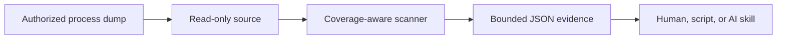

<div align="center">

# Membridge

**A deterministic, bounded bridge between AI workflows and process memory.**

[](https://github.com/sharkone/membridge/actions/workflows/ci.yml)
[](https://www.rust-lang.org/)

</div>

Membridge gives humans, scripts, and AI coding agents a compact read-only interface to authorized process-memory captures. The tool performs exact mechanics—coverage inspection, byte scanning, address attribution, and bounded reads—while the caller decides what values mean and how findings relate to source code.

The project is an early public prototype. Its first source is Windows x64 user-mode minidumps; live process and DMA acquisition remain roadmap work.

## Why Membridge?

Sending arbitrary memory to a language model is unsafe, expensive, and usually useless. Membridge keeps bulk memory local and returns only bounded evidence:

- explicit capture coverage and gaps;
- tagged exact-byte matches;
- virtual addresses, modules, RVAs, and region metadata;
- deterministic match limits and continuation points;
- small caller-requested byte windows.



## Current capabilities

- Windows x64 `Memory64ListStream` and `MemoryListStream` minidumps.
- Memory-mapped, zero-copy scanning of captured bytes.
- BLAKE3 source fingerprints.
- Region state, protection, type, and capture coverage.
- Module names, image bases, sizes, timestamps, and match RVAs.
- Tagged batches of 1–64 exact byte patterns.
- Overlapping and page-boundary matches.
- Per-pattern alignment constraints.
- Deterministic result ordering and hard match quotas.
- Gap-aware reads capped at 65,536 bytes.
- One compact schema-v1 JSON object per command.
- A version-matched portable Agent Skill embedded in the binary.

## Deliberate boundaries

Membridge does not currently:

- capture or attach to running processes;
- write, allocate, protect, suspend, or execute memory;
- resolve PDB symbols;
- disassemble or infer structures;
- scan typed values, masked patterns, pointers, or YARA rules;
- classify sensitive data automatically;
- send telemetry or contact network services.

See [ROADMAP.md](ROADMAP.md) for the planned sequence and [PLAN.md](PLAN.md) for current implementation decisions.

## Quick start

### Requirements

- Stable Rust 1.87 or newer.
- An authorized Windows x64 user-mode minidump for real analysis.

### Install the latest development build

The repository is public but has not published a versioned release. Install the current `main` revision directly from GitHub:

```sh
cargo install \
  --git https://github.com/sharkone/membridge.git \
  --locked \
  --force

membridge skill install --omp --force
```

This requires Rust and OMP on `PATH`. Start a new OMP session after installing the skill.

### Build

```sh
cargo build --release
```

The executable is `target/release/membridge` on Unix-like hosts and `target\release\membridge.exe` on Windows.

### Run the deterministic demo

The repository includes a synthetic Windows AMD64 minidump generator. Its fixture contains two readable canaries, one canary crossing a page boundary, an identical no-access decoy, and one missing readable region.

```sh
./examples/demo.sh
```

The expected scan matches are:

```text
0x0000000140000100
0x0000000140000ffc
```

The no-access decoy is excluded, and coverage reports 4,096 unavailable readable bytes.

## Command surface

```text
membridge inspect <dump>
membridge scan <dump> --spec <path|->
membridge read <dump> --address <address> [--length <1..65536>]
membridge skill install (--omp | --target <skills-root>) [--force]
```

All commands emit one JSON object. Success responses have:

```json
{
  "schema": 1,
  "ok": true,
  "command": "inspect",
  "data": {}
}
```

Failures contain a stable code, human message, and retryability flag.

## Inspect coverage first

```sh
membridge inspect capture.dmp
```

Important fields:

- `data.source.fingerprint`
- `data.coverage.metadata_complete`
- `data.coverage.coverage_complete`
- `data.coverage.unavailable_readable_bytes`
- `data.coverage.limitations`
- `data.regions`
- `data.modules`

A dump may parse successfully while omitting readable process memory. Membridge exposes that distinction rather than turning missing pages into false negatives.

`limitations` is a deterministically ordered list with at most four stable codes:

- `MEMORY_METADATA_MISSING`: the dump has no memory-information stream;
- `MEMORY_METADATA_UNUSABLE`: the stream exists but cannot be parsed;
- `EXPECTED_READABLE_SCOPE_UNPROVEN`: available metadata cannot establish the process's expected readable scope;
- `KNOWN_READABLE_BYTES_MISSING`: metadata identifies readable bytes absent from the capture; `unavailable_readable_bytes` gives the exact known count.

Missing or unusable metadata is accompanied by `EXPECTED_READABLE_SCOPE_UNPROVEN`. In that case, zero unavailable bytes does not prove complete coverage.

## Scan exact representations

Create a versioned specification:

```json
{
  "schema": 1,
  "patterns": [
    {
      "tag": "canary.utf8",
      "bytes_hex": "4d42524944474521",
      "alignment": 1
    }
  ],
  "max_matches": 10000
}
```

Then scan:

```sh
membridge scan capture.dmp --spec scan.json
```

For sensitive values, prefer a protected file or stdin instead of command-line arguments:

```sh
membridge scan capture.dmp --spec - < scan.json
```

Interpret the result using both dimensions:

- `scan_complete` says whether scanning exhausted the selected captured scope;
- `coverage_complete` says whether the capture contained all expected readable memory.

A complete scan over incomplete coverage proves only “not observed in captured scope.”

Use `coverage.limitations` to explain incomplete coverage. Do not infer the cause from the booleans or byte counts alone.

## Read bounded context

```sh
membridge read capture.dmp \
  --address 0x0000000140000100 \
  --length 64
```

Reads return one or more valid segments. `complete: false` means some requested bytes were absent. Never concatenate separated segments as if they were contiguous memory.

## Agent Skill

The canonical portable skill lives at [.agents/skills/membridge](.agents/skills/membridge). OMP discovers it directly in this repository through its Agent Skills provider.

The binary embeds the same files at compile time. To install the version-matched skill into the active OMP-native user profile:

```sh
membridge skill install --omp
```

This runs `omp config path`, then installs under that agent directory:

```text
<active-omp-agent-dir>/skills/membridge/
  SKILL.md
  examples/canary-batch.json
```

OMP must be on `PATH`. Delegating path discovery to OMP honors its active profile and configured agent directory. Missing OMP reports `OMP_NOT_FOUND`; invalid or failed discovery reports `OMP_DISCOVERY_FAILED`.

For another Agent Skills-compatible client, provide its skills root explicitly:

```sh
membridge skill install --target ~/.agents/skills
```

Installation output includes `binary_version` and `skill_version`; they are identical because the skill is embedded at compile time. Installed copies do not update automatically. After updating the binary, rerun the command with `--force`, then start a new OMP session.

The skill teaches coverage-first scanning, deterministic representation generation, bounded reads, and evidence language. It contains no unimplemented roadmap commands.

## Use cases

### Sensitive-data canaries

Place known non-production canaries in authorized dev builds, capture the process, and search their explicit UTF-8, UTF-16LE, numeric, or serialized byte forms. Use the region and module attribution to identify unexpected copies.

### Copy and lifetime investigation

Compare where a known value appears across controlled captures. Current Membridge analyzes each dump independently; persisted cross-snapshot refinement is planned.

### Protection validation

Confirm whether plaintext or decoded material remains in readable committed memory after the application claims to erase or protect it. An incomplete capture cannot prove absence.

### Reverse-engineering support

Locate known headers, identifiers, and sentinel values, then hand exact addresses and RVAs to a debugger or disassembler. Membridge does not replace those tools.

Only use Membridge on processes and captures you are authorized to inspect.

## Architecture

```text
src/source/       acquisition-neutral read-only interfaces and minidump adapter
src/scan.rs       deterministic tagged exact-byte scanner
src/protocol.rs   schema-v1 success and failure envelopes
src/skill.rs      version-matched embedded skill installer
src/main.rs       compact CLI surface
.agents/skills/   canonical portable AI workflow knowledge
tests/            behavioral source, scanner, quota, read, CLI, and skill tests
examples/         deterministic fixture and runnable demo
```

The internal source boundary has no write operation. Future Windows and VMM sources must reuse the same normalized process-memory contract rather than create parallel scan engines.

## Development

```sh
cargo fmt --all --check
cargo clippy --all-targets -- -D warnings
cargo test
./examples/demo.sh
```

Repository expectations and invariants are defined in [AGENTS.md](AGENTS.md). Planned work is tracked in [ROADMAP.md](ROADMAP.md) and GitHub issues. Pull requests should update documentation and the embedded skill whenever observable CLI behavior changes.

## Status and licensing

This repository is public and has no redistribution license. Public visibility does not grant redistribution rights; all rights are reserved unless a license is added explicitly. Binary releases and the VMM/MemProcFS integration remain gated on deliberate distribution and license decisions.
