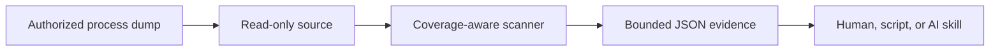

<div align="center">

# Membridge

**A deterministic, bounded bridge between AI workflows and process memory.**

[](https://github.com/sharkone/membridge/actions/workflows/ci.yml)
[](https://www.rust-lang.org/)
[](LICENSE-MIT)

</div>

Membridge gives humans, scripts, and AI coding agents a compact read-only interface to authorized process-memory captures. The tool performs exact mechanics—coverage inspection, byte scanning, address attribution, and bounded reads—while the caller decides what values mean and how findings relate to source code.

The project is an early public prototype. Its first source is Windows x64 user-mode minidumps; live process and DMA acquisition remain roadmap work.

## Why Membridge?

Sending arbitrary memory to a language model is unsafe, expensive, and usually useless. Membridge keeps bulk memory local and returns only bounded evidence:

- explicit capture coverage and gaps;
- tagged matches for typed, string, and masked values;
- bounded, explicit scan scopes;
- virtual addresses, modules, RVAs, and region metadata;
- deterministic match limits and continuation points;
- small caller-requested byte windows.



## Current capabilities

- Windows x64 `Memory64ListStream` and `MemoryListStream` minidumps.
- Windows-only live-process capture into a full-memory minidump, published atomically and imported automatically.
- Memory-mapped, zero-copy scanning of captured bytes.
- BLAKE3 source fingerprints.
- Region state, protection, type, and capture coverage.
- Module names, image bases, sizes, timestamps, and match RVAs.
- Tagged batches of 1–64 patterns: exact bytes, integers, floats, UTF-8, UTF-16LE, and masks.
- Explicit integer width, signedness, and byte order; exact `f32`/`f64` bit patterns.
- Byte- and nibble-granular masked patterns.
- Bounded scan scopes over modules, regions, address ranges, protection classes, and memory types.
- Overlapping and page-boundary matches.
- Per-pattern alignment constraints.
- Deterministic result ordering and hard match quotas.
- Gap-aware reads capped at 65,536 bytes.
- One compact schema-v3 JSON object per command.
- A version-matched portable Agent Skill embedded in the binary.

## Deliberate boundaries

Membridge does not currently:

- attach to or live-scan running processes (only a one-shot Windows capture is supported);
- write, allocate, protect, suspend, or execute memory;
- resolve PDB symbols;
- disassemble, decode values it finds, or infer structures;
- scan pointers or YARA rules, or refine results across captures;
- classify sensitive data automatically;
- send telemetry or contact network services.

See [ROADMAP.md](ROADMAP.md) for the planned sequence and [PLAN.md](PLAN.md) for current implementation decisions.

## Quick start

### Requirements

- An authorized Windows x64 user-mode minidump for real analysis.

### Install via the plugin marketplace (recommended)

Membridge ships as a portable [Agent Skill](.agents/skills/membridge) with a marketplace catalog that OMP and Claude Code load directly from this repository — no separate registry, no copied skill tree.

OMP:

```sh
omp plugin marketplace add sharkone/membridge
omp plugin install membridge@membridge
```

Claude Code:

```text
/plugin marketplace add sharkone/membridge
/plugin install membridge@membridge
```

This installs the version-matched skill. If your agent doesn't already have a matching `membridge` executable on `PATH`, the skill's own instructions let it offer to run a checksum-verified bootstrap script after your explicit approval. See [Agent Skill](#agent-skill) for the installed layout, versioning, and exactly what that bootstrap does and does not do.

Other Agent Skills clients can point their own skill loader directly at [.agents/skills/membridge](.agents/skills/membridge).

### Install the CLI directly

macOS and Linux:

```sh
curl --proto '=https' --tlsv1.2 -LsSf \
  https://github.com/sharkone/membridge/releases/download/v0.1.0-alpha.2/membridge-installer.sh |
  sh

membridge skill install --force
```

Windows PowerShell:

```powershell
irm https://github.com/sharkone/membridge/releases/download/v0.1.0-alpha.2/membridge-installer.ps1 | iex
membridge skill install --force
```

The release installers place `membridge` under Cargo's binary directory. `membridge skill install` installs directly to the common `~/.agents/skills` location; agent discovery support for that location varies. Alpha binaries are checksummed but unsigned and not notarized.

## Command surface

```text
membridge inspect <dump>
membridge scan <dump> --spec <path|->
membridge read <dump> --address <address> [--length <1..65536>]
membridge skill install [--force]
membridge capture minidump --pid <pid> --output <path> [--force]
```

Command execution emits one compact JSON object. Standard metadata flags such as `--help` and `--version` print text and exit successfully. Success responses have:

```json
{
  "schema": 3,
  "ok": true,
  "command": "inspect",
  "data": {}
}
```

Failures contain a stable code, human message, and retryability flag.

## Inspect coverage first

```sh
membridge inspect capture.dmp
```

Important fields:

- `data.source.fingerprint`
- `data.coverage.metadata_complete`
- `data.coverage.coverage_complete`
- `data.coverage.unavailable_readable_bytes`
- `data.coverage.limitations`
- `data.regions`
- `data.modules`

A dump may parse successfully while omitting readable process memory. Membridge exposes that distinction rather than turning missing pages into false negatives.

`limitations` is a deterministically ordered list with at most four stable codes:

- `MEMORY_METADATA_MISSING`: the dump has no memory-information stream;
- `MEMORY_METADATA_UNUSABLE`: the stream exists but cannot be parsed;
- `EXPECTED_READABLE_SCOPE_UNPROVEN`: available metadata cannot establish the process's expected readable scope;
- `KNOWN_READABLE_BYTES_MISSING`: metadata identifies readable bytes absent from the capture; `unavailable_readable_bytes` gives the exact known count.

Missing or unusable metadata is accompanied by `EXPECTED_READABLE_SCOPE_UNPROVEN`. In that case, zero unavailable bytes does not prove complete coverage.

## Scan typed representations

Create a versioned specification. Each pattern has a `tag`, an optional
`alignment` (default 1), and one typed `value`:

```json
{
  "schema": 2,
  "patterns": [
    {
      "tag": "canary.utf8",
      "value": { "kind": "utf8", "text": "MBRIDGE!" },
      "alignment": 1
    },
    {
      "tag": "handle.u32",
      "value": {
        "kind": "int",
        "number": "0xdeadbeef",
        "width": 32,
        "signed": false,
        "endian": "little"
      },
      "alignment": 4
    },
    {
      "tag": "canary.masked",
      "value": {
        "kind": "masked",
        "bytes_hex": "4d42000000004521",
        "mask_hex": "ffff00000000ffff"
      }
    }
  ],
  "max_matches": 10000
}
```

| kind | fields | bytes searched |
|---|---|---|
| `bytes` | `bytes_hex` | those exact bytes |
| `int` | `number`, `width` (8/16/32/64), `signed`, `endian` (`little`/`big`) | two's-complement encoding |
| `float` | `number`, `width` (32/64), `endian` | IEEE-754 bit pattern |
| `utf8` | `text` | UTF-8 encoding |
| `utf16le` | `text` | UTF-16LE encoding |
| `masked` | `bytes_hex`, `mask_hex` | bytes compared as `found & mask_hex == bytes_hex` |

`number` is a string so 64-bit values never pass through lossy JSON floats.
Integers accept decimal or `0x` hexadecimal with an optional leading `-` and must
fit the declared width and signedness. Floats accept forms such as `"3.5"`,
`"1e-3"`, `"inf"`, and `"-inf"`, are encoded as the nearest representable value,
and reject `NaN`, which has no single byte representation. Masks may be nibble- or
bit-granular; value bits outside the mask must be zero, and a mask needs at least
one fully known (`ff`) byte.

Then scan:

```sh
membridge scan capture.dmp --spec scan.json
```

For sensitive values, prefer a protected file or stdin instead of command-line arguments:

```sh
membridge scan capture.dmp --spec - < scan.json
```

### Narrow the scan scope

An optional `scope` restricts the scan to captured readable bytes inside an
explicit address space. Categories intersect, selectors within a category form a
union, and an omitted category adds no constraint:

```json
{
  "schema": 2,
  "patterns": [{ "tag": "canary.utf8", "value": { "kind": "utf8", "text": "MBRIDGE!" } }],
  "scope": {
    "modules": ["fixture.exe"],
    "regions": [0],
    "ranges": [{ "start": "0x140000000", "length": "0x2000" }],
    "protections": ["page_readwrite"],
    "types": ["private"]
  },
  "max_matches": 10000
}
```

- `modules` accepts a full image path or a bare file name, compared
  case-insensitively. A selector matching no captured module, or more than one,
  fails with `UNRESOLVED_SCOPE` instead of guessing.
- `regions` uses the `id` values `inspect` reports; an unknown id fails.
- `ranges` takes decimal or `0x` `start`/`length` strings with positive length.
- `protections` and `types` need region metadata; without it the scan fails with
  `SCOPE_METADATA_UNAVAILABLE` rather than scanning an unproven scope.
- At most 32 selectors per category.

A match is reported only when all of its bytes lie inside the scope, so a value
straddling a scope edge is omitted rather than half-matched. The report echoes
the resolution:

```json
{
  "applied": ["modules", "protections"],
  "interval_count": 1,
  "selected_bytes": 8192,
  "scanned_bytes": 8192
}
```

`selected_bytes` is the size of the intersection and is `null` for an unscoped
scan; `scanned_bytes` counts the captured readable bytes actually examined. A
large `selected_bytes` with a small `scanned_bytes` means the capture omitted most
of the requested scope.

### Interpret the result

Use both dimensions:

- `scan_complete` says whether scanning exhausted the selected captured scope;
- `coverage_complete` says whether the capture contained all expected readable memory.

A complete scan over incomplete coverage proves only “not observed in captured scope.”

Use `coverage.limitations` to explain incomplete coverage. Do not infer the cause from the booleans or byte counts alone.

## Read bounded context

```sh
membridge read capture.dmp \
  --address 0x0000000140000100 \
  --length 64
```

Reads return one or more valid segments. `complete: false` means some requested bytes were absent. Never concatenate separated segments as if they were contiguous memory.

## Capture a live process (Windows only)

```sh
membridge capture minidump --pid 4104 --output capture.dmp
```

`capture minidump` opens only the requested process with read-only rights, calls `MiniDumpWriteDump` with a full-memory profile, publishes the result atomically, and immediately imports it. Every other host returns `UNSUPPORTED_HOST`. An existing `--output` path is left untouched unless `--force` is passed.

The response reports:

- `data.process`: PID, resolved image path, and process creation time;
- `data.interval`: capture start and completion timestamps;
- `data.flags`: the exact `MiniDumpWriteDump` profile used;
- `data.warnings`: bounded, stable capture-time conditions such as `PROCESS_ALREADY_EXITED`;
- `data.source` and `data.coverage`: identical in shape to `inspect`, computed by re-opening the published file, so the report never has to be trusted blindly.

Feed the resulting file straight into `inspect`, `scan`, or `read`; capture never scans or reads memory itself.

## Agent Skill

The canonical portable skill lives at [.agents/skills/membridge](.agents/skills/membridge). Agent Skills clients can discover it directly from this repository, and the binary embeds the same files at compile time.

### Marketplace install (OMP, Claude Code)

`.claude-plugin/marketplace.json` is a Claude Code-compatible catalog that points directly at the canonical `.agents` tree; OMP loads that same format as a compatibility fallback. No second skill copy is maintained.

OMP:

```sh
omp plugin marketplace add sharkone/membridge
omp plugin install membridge@membridge
```

Claude Code:

```text
/plugin marketplace add sharkone/membridge
/plugin install membridge@membridge
```

Marketplace package versions use `<binary-version>.skill.<revision>`, so skill-only releases can ship independently while staying pinned to a specific compatible Membridge binary version; the skill still checks that binary before use.

The marketplace adapter installs and updates the skill package, including its opt-in bootstrap scripts under `scripts/`, but never executes them — plugin installation has no portable lifecycle-hook contract. Running a bootstrap script remains a separate, explicit, user-approved action (see below).

### Direct install for other Agent Skills clients

Clients without marketplace-style plugin installation can point their own Agent Skills loader at [.agents/skills/membridge](.agents/skills/membridge) directly, or install it through the binary:

```sh
membridge skill install
```

The destination is `~/.agents/skills/membridge`. Membridge reads `HOME` on macOS and Linux and `USERPROFILE`, with `HOME` as a fallback, on Windows. The resolved home directory must be absolute; unavailable or invalid home discovery reports `HOME_DIRECTORY_UNAVAILABLE`.

Installation output includes matching `binary_version` and `skill_version` fields. Installed copies do not update automatically; rerun the command with `--force` after updating the binary.

The installed skill also includes explicit, version-pinned binary bootstrap scripts under `scripts/`. If the matching executable is absent, an agent may offer to run the host script after explaining the download and receiving user approval:

```sh
sh scripts/install.sh
```

```powershell
powershell -NoProfile -ExecutionPolicy Bypass -File .\scripts\install.ps1
```

The scripts enforce download size limits and SHA-256 verification before installing executable code, then verify `membridge --version`. They skip installation when the matching binary is already available. They never run during skill discovery or activation and perform no update check after installation.

The skill describes the available commands, analyses, limits, result semantics, and deliberate boundaries. It contains no unimplemented roadmap commands.

## Use cases

### Sensitive-data canaries

Place known non-production canaries in authorized dev builds, capture the process, and search their explicit UTF-8, UTF-16LE, numeric, or serialized byte forms. Use the region and module attribution to identify unexpected copies.

### Copy and lifetime investigation

Compare where a known value appears across controlled captures. Current Membridge analyzes each dump independently; persisted cross-snapshot refinement is planned.

### Protection validation

Confirm whether plaintext or decoded material remains in readable committed memory after the application claims to erase or protect it. An incomplete capture cannot prove absence.

### Reverse-engineering support

Locate known headers, identifiers, and sentinel values, then hand exact addresses and RVAs to a debugger or disassembler. Membridge does not replace those tools.

Only use Membridge on processes and captures you are authorized to inspect.

## Architecture

```text
src/source/       acquisition-neutral read-only interfaces and minidump adapter
src/capture.rs    Windows-only MiniDumpWriteDump live-process capture
src/scan.rs       deterministic typed, masked, and scoped scanner
src/protocol.rs   schema-v3 success and failure envelopes
src/skill.rs      version-matched embedded skill installer
src/main.rs       compact CLI surface
.agents/skills/   canonical portable AI workflow knowledge
.claude-plugin/    Claude Code-compatible marketplace catalog loaded by OMP
tests/            behavioral source, scanner, scope, quota, read, CLI, and skill tests
examples/         deterministic fixture and runnable demo
```

The internal source boundary has no write operation. Future Windows and VMM sources must reuse the same normalized process-memory contract rather than create parallel scan engines.

## Development

Building requires Rust on `PATH`.

```sh
cargo build --release
```

The executable is `target/release/membridge` on Unix-like hosts and `target\release\membridge.exe` on Windows. To try the current `main` revision without cloning:

```sh
cargo install --git https://github.com/sharkone/membridge.git --locked --force
membridge skill install --force
```

### Deterministic demo

The repository includes a synthetic Windows AMD64 minidump generator. Its fixture contains two readable UTF-8 canaries, one of them crossing a page boundary, a UTF-16LE copy, planted little- and big-endian integers and floats, an identical no-access decoy, and one missing readable region.

```sh
./examples/demo.sh
```

The demo runs both shipped specifications. `examples/canary-batch.json` matches the UTF-8, UTF-16LE, and masked canaries:

```text
0x0000000140000100  membridge-canary.masked, membridge-canary.utf8
0x0000000140000230  membridge-canary.utf16le
0x0000000140000ffc  membridge-canary.masked, membridge-canary.utf8
```

`examples/scoped-batch.json` scopes the scan to the `fixture.exe` module intersected with `page_readwrite` regions and matches the planted typed values:

```text
0x0000000140000200  u32.le
0x0000000140000208  i64.le
0x0000000140000218  f32.le
0x0000000140000220  f64.le
0x0000000140000228  u16.be
```

The no-access decoy is excluded, and coverage reports 4,096 unavailable readable bytes.

### Validate a change

```sh
cargo fmt --all --check
cargo clippy --all-targets -- -D warnings
cargo test
./examples/demo.sh
```

Repository expectations and invariants are defined in [AGENTS.md](AGENTS.md). Planned work is tracked in [ROADMAP.md](ROADMAP.md) and GitHub issues. Pull requests should update documentation and the embedded skill whenever observable CLI behavior changes.

## Status and licensing

Membridge is licensed under either the [MIT License](LICENSE-MIT) or [Apache License 2.0](LICENSE-APACHE), at your option. Alpha releases are checksummed but unsigned and not notarized testing releases. VMM/MemProcFS distribution remains gated on a separate licensing and packaging decision.
